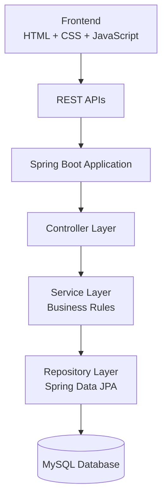
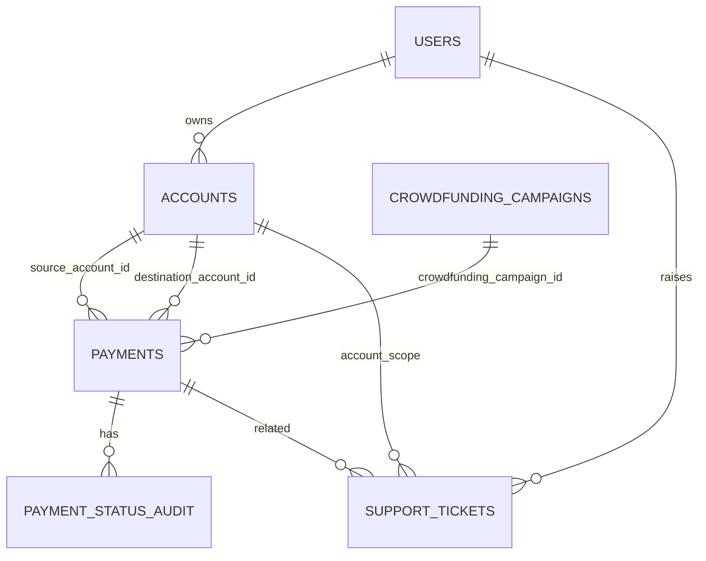

# Payment Processing System

## Project Overview
The **Payment Processing System** is a full-stack web application for managing users, bank accounts, payments, crowdfunding campaigns, and support tickets in a single workflow.

It addresses a common business problem: teams need to process account-to-account payments with validation, status tracking, auditability, and operational support (tickets/disputes) while also handling multi-currency flows.

### Main Objectives
- Provide a consistent payment workflow for normal and crowdfunding transactions.
- Enforce business validations (ownership, limits, balance, currency).
- Track payment lifecycle transitions through auditable status logs.
- Offer user-scoped dashboards and transaction history.
- Support operational recovery through tickets and dispute flows.

### Key Capabilities
- Multi-user, multi-account management.
- INR/USD payment support with conversion and forex fee handling.
- Payment status lifecycle + audit trail.
- Crowdfunding campaign creation, bucket collection, and settlement.
- Receiver-side payment reversal for eligible completed payments.
- Ticket management and dispute handling.

---

## Features

### 1) User Management and Multi-User Support
**Purpose**: Maintain multiple system users with profile and limit data.

**User Flow**:
1. Create user from landing page.
2. Select existing user.
3. Continue with that user workspace.

**How it works**:
- Backend: `UserController`, `UserService`, `UserRepository`.
- Data includes `fullName`, `email`, `defaultCurrency`, `dailyTransactionLimit`, and optional profile fields.

### 2) Multiple Bank Accounts per User
**Purpose**: Allow a user to operate multiple accounts.

**User Flow**:
1. Create account while creating user or later.
2. Select a specific account before entering dashboard.

**How it works**:
- `users` to `accounts` is one-to-many.
- Ownership checks are enforced in payment service.

### 3) Account Selection Workflow
**Purpose**: Scope dashboard actions to a selected account context.

**User Flow**:
1. Landing (`index.html` + `landing.js`) shows users.
2. User selection shows their accounts.
3. Selected account is stored in local storage and used by dashboard.

### 4) Payment Creation (Regular + Crowdfunding)
**Purpose**: Create account-to-account transactions with validations.

**User Flow**:
1. Choose source/destination and amount.
2. Confirm payment.
3. System validates, processes, updates balances, and records history.

**How it works**:
- `POST /api/payments` with `CreatePaymentRequest`.
- Supports `paymentType` values normalized to `NORMAL_PAYMENT` or `CROWDFUNDING_PAYMENT`.

### 5) Multi-Currency Support (INR/USD), Conversion, Forex Fee
**Purpose**: Support cross-currency payments between INR and USD accounts.

**How it works**:
- Supported currencies: `INR`, `USD`.
- Exchange constant in service: `1 USD = 93 INR`.
- Forex fee rate: `1.8%`.
- Forex fee applies on **inter-currency** transactions.

### 6) Payment Lifecycle and Status Tracking
**Purpose**: Make processing states explicit and auditable.

**Statuses in model**:
- `INITIATED`, `CREATED`, `VALIDATED`, `PROCESSING`, `SENT`, `COMPLETED`, `SUCCESS`, `FAILED`, `CANCELLED`, `REVERSED`.

**Lifecycle (main flow)**:
- `CREATED -> VALIDATED -> PROCESSING -> COMPLETED`.
- Failures transition to `FAILED` with reason.

### 7) Payment Audit Logs
**Purpose**: Persist all meaningful status transitions and operational notes.

**How it works**:
- `payment_status_audit` stores `from_status`, `to_status`, `description`, `changed_at`.
- Exposed via:
  - `GET /api/payments/{id}/history?userId=...`
  - `GET /api/audits`
  - `GET /api/audits/payment/{paymentId}`

### 8) Transaction History and Filtering
**Purpose**: Let users inspect and filter payment activity.

**Current dashboard filters**:
- `reference`, `senderName`, `receiverName`, `status`, `paymentType`, `currency`, `minAmount`, `maxAmount`.

**Backend filter support** (API-level):
- Also supports `timeWindow` ( `QUARTERLY`, `ANNUALLY`) plus sorting.

### 9) CSV / PDF Export
**Purpose**: Export filtered transaction data for reporting.

**How it works**:
- Frontend generates CSV/PDF from currently loaded filtered rows in dashboard.

### 10) Dashboard Analytics
**Purpose**: Show user-scoped financial KPIs.

**Metrics**:
- Total payments, successful, failed, pending.
- Success percentage.
- Total processed amount, average, largest transaction.
- Total balance, income, expense.
- Daily limit, spent today, remaining limit.
- Crowdfunding donations.

### 11) Daily Transaction Limits
**Purpose**: Restrict spending by user-level and account-level thresholds.

**How it works**:
- User-level daily limit from `users.daily_transaction_limit`.
- Account-level max daily amount from `accounts.max_daily_limit`.
- Validation checks both constraints during payment processing.

### 12) Payment Validation
**Purpose**: Prevent invalid/unsafe operations.

**Validation includes**:
- User ID and account IDs required.
- Source != destination.
- Account ownership and status checks.
- Balance checks.
- Currency checks.
- Amount > 0 and upper bound.
- Daily limit checks.

### 13) Failed Payment Handling
**Purpose**: Capture failure reason and trigger support flow.

**How it works**:
- Failed payment stores `errorCode`.
- Automatic high-priority ticket is created for failed payments.

### 14) Ticket Management
**Purpose**: Manage operational issues and disputes.

**Capabilities**:
- Create general and transaction-linked tickets.
- Filter tickets by status/payment/user/type/query.
- Update ticket status and resolution summary.

### 15) Wrong Recipient / Unexpected Payment Dispute Support
**Purpose**: Let sender and receiver raise structured disputes.

**How it works**:
- UI exposes sender/receiver dispute actions in transaction list.
- Backend supports dispute ticket creation and role validation.

### 16) Receiver Payment Reversal (Return Payment)
**Purpose**: Allow a receiver to return eligible completed payments back to sender.

**User Flow**:
1. Return action is shown only for eligible received successful non-crowdfunding payments.
2. Confirmation popup shows sender, receiver, amount, currency, reference.
3. On confirm, frontend calls `POST /api/payments/{id}/reverse`.
4. Balances, dashboard, transactions, and audit views refresh.

**How it works**:
- Backend validates ownership, status, duplication, and balance.
- Creates separate reversal transaction linked to original.
- Sets reversal status to `REVERSED` and writes audit entries.

### 17) Crowdfunding Bucket System
**Purpose**: Isolate campaign funds from normal accounts until campaign completion.

**How it works**:
- Campaign creation auto-creates a dedicated bucket account.
- Donations flow into bucket as crowdfunding payments.
- On target completion, bucket amount is settled to creator payout account via a recorded settlement transaction.

### 18) User-Specific Data Handling
**Purpose**: Prevent cross-user data exposure.

**How it works**:
- Workspace and payment listing endpoints are user scoped.
- Payment history endpoint requires `userId` and verifies ownership of source/destination account set.

---

## System Architecture



### Frontend Layer
- Static UI in `frontend/`.
- Main screens:
  - `index.html` + `landing.js` (user/account selection and creation).
  - `dashboard.html` + `dashboard.js` (payments, crowdfunding, tickets, profile, analytics).
- Communicates with backend via `fetch` to `/api/*`.
- Handles client-side input checks and dynamic rendering (tables, badges, modals, toasts, exports).

### Controller Layer
- Exposes REST resources for users, accounts, payments, campaigns, audits, and tickets.
- Performs request parameter binding and delegates to services.

### Service Layer
- Core business logic:
  - Payment processing lifecycle.
  - Currency conversion + forex fee.
  - Daily limit and ownership validations.
  - Crowdfunding campaign bucket/settlement behavior.
  - Reversal logic.
  - Automatic ticket creation on failures.

### Repository Layer
- Spring Data JPA repositories with derived queries and custom JPQL for user-scoped payment retrieval and daily spend aggregation.

### Database Layer
- MySQL-backed persistence.
- Schema and migration-safe initialization in `schema.sql`.
- Optional seed data in `data.sql`.

---
```

---

## Database Design

### Core Tables

| Table | Purpose | Important Fields | Relationships |
|---|---|---|---|
| `users` | Stores user profiles and daily limit settings | `user_id`, `full_name`, `email`, `default_currency`, `daily_transaction_limit` | 1 user -> many `accounts`; referenced by `support_tickets.user_id` |
| `accounts` | Stores wallet/bank account data | `account_id`, `user_id`, `currency_code`, `balance`, `account_status`, `is_bucket_account`, `max_daily_limit` | Many accounts belong to one user; referenced by `payments.source_account_id`, `payments.destination_account_id`, campaign bucket/payout |
| `crowdfunding_campaigns` | Campaign master data | `campaign_id`, `bucket_account_id`, `creator_payout_account_id`, `target_amount`, `target_currency`, `current_amount`, `status` | References `accounts` for bucket and payout; referenced by `payments.crowdfunding_campaign_id` |
| `payments` | Transaction ledger | `payment_id`, `payment_reference`, `source_account_id`, `destination_account_id`, `amount`, `currency_code`, `destination_currency_code`, `payment_type`, `status`, `original_payment_id`, `reversal_payment_id`, `reversal_reason` | References accounts and campaign; self-references for reversal linkage |
| `payment_status_audit` | Audit trail for payment transitions | `audit_id`, `payment_id`, `from_status`, `to_status`, `description`, `changed_at` | Many audit rows per payment |
| `support_tickets` | Support/issue/dispute tickets | `ticket_id`, `ticket_number`, `payment_id`, `account_id`, `user_id`, `ticket_type`, `priority`, `status`, `dispute_role` | Optional link to payment; links account and user |

### Relationship Diagram



---

### Successful Payments
- Transition through `CREATED -> VALIDATED -> PROCESSING -> COMPLETED`.
- Debit source by `finalChargedAmount` and credit destination by converted destination amount.

### Failed Payments
- Any validation/processing exception marks payment `FAILED`.
- Failure reason is stored in `errorCode`.
- System auto-creates a failed-payment support ticket.

### Cancelled Payments
- `PATCH /api/payments/{id}/cancel` marks eligible non-terminal records to failed-cancel state with reason.

### Reversed Payments
- Receiver can initiate reversal for eligible completed transactions.
- Creates a separate reversal transaction and links original/reversal IDs.

---

### Implemented Behavior
- Campaign creation requires payout account and creates a dedicated bucket account.
- Contributions route to bucket account.
- On completion, bucket amount is transferred to creator payout account and saved as transaction.

---

## Currency Conversion Logic

- Supported currencies: `INR`, `USD`.
- Exchange constant in service layer: **`1 USD = 93 INR`**.
- For same currency, exchange rate is `1`.
- Inter-currency transactions:
  - Convert source equivalent using configured rate.
  - Apply forex fee at `1.8%` on source-equivalent charge basis.
- Intra-currency transactions:
  - No forex fee.

---

## Validation Rules

Implemented validations include:
- Account existence (source/destination must exist).
- Account ownership validation (source must belong to requesting user).
- Account status validation (active accounts required).
- Amount validation (`> 0`, max threshold).
- Currency validation (`INR/USD` only).
- Source-destination mismatch (cannot be same account).
- Balance sufficiency validation.
- Daily limit validation (user + account limits).
- Destination/source account number matching when provided.
- Duplicate prevention via idempotency key check.
- Reversal validations (eligible status, non-crowdfunding, receiver ownership, sufficient receiver balance, not already reversed).

---

## Ticket and Dispute System

### Ticket Types
- General tickets.
- Failed payment tickets (auto-generated).
- Transaction-linked tickets.
- Dispute sender / dispute receiver types.

### Dispute Scenarios
- **Wrong Recipient** (sender side).
- **Unexpected Payment** (receiver side).

### Ticket Lifecycle Statuses
- `OPEN`
- `IN_PROGRESS`
- `RESOLVED`
- `CLOSED`

---

## Dashboard Documentation

The dashboard displays:
- Current selected account balance.
- Total payments.
- Completed payments.
- Failed payments.
- Daily limit utilization (limit/spent/remaining).
- User profile and configurable daily limit.
- Transaction table with filtering and export.
- Ticket management table.
- Crowdfunding campaign cards with progress/target/deadline.

Analytics metrics are sourced from `DashboardAnalyticsResponse` and include:
- `totalPayments`, `successfulPayments`, `failedPayments`, `pendingPayments`
- `successPercentage`
- `totalAmountProcessed`, `averageTransactionAmount`, `largestTransaction`
- `totalBalance`, `income`, `expense`
- `dailyTransactionLimit`, `spentToday`, `remainingDailyLimit`
- `crowdfundingDonations`

---


### User APIs

| Method | Endpoint | Purpose | Request Body | Response |
|---|---|---|---|---|
| GET | `/api/users` | List users | - | `List<User>` |
| GET | `/api/users/{id}` | Get user by ID | - | `User` |
| POST | `/api/users` | Create user | `User` | `User` |
| PATCH | `/api/users/{id}/daily-limit` | Update user daily limit | `{ dailyTransactionLimit }` | `User` |
| GET | `/api/users/{id}/accounts` | List user accounts | - | `List<Account>` |
| GET | `/api/users/{id}/workspace` | Aggregated user workspace | - | `{user, accounts, payments, tickets, campaigns, dashboard, primaryWallet}` |
| POST | `/api/users/{id}/accounts` | Create account for user | `Account` | `Account` |

### Account APIs

| Method | Endpoint | Purpose | Request Body | Response |
|---|---|---|---|---|
| GET | `/api/accounts?userId=` | List all or user accounts | - | `List<Account>` |
| GET | `/api/accounts/{id}` | Get account | - | `Account` |
| POST | `/api/accounts` | Create account | `Account` | `Account` |
| PUT | `/api/accounts/{id}` | Update account | `Account` | `Account` |
| DELETE | `/api/accounts/{id}` | Delete account | - | `204 No Content` |

### Payment APIs

| Method | Endpoint | Purpose | Request Body | Response |
|---|---|---|---|---|
| GET | `/api/payments` | User-scoped payment list + filtering/sorting | - | `List<Payment>` |
| GET | `/api/payments/{id}` | Get payment by ID | - | `Payment` |
| GET | `/api/payments/{id}/history?userId=` | User-scoped payment audit history | - | `List<PaymentStatusAudit>` |
| POST | `/api/payments` | Create payment | `CreatePaymentRequest` | `Payment` |
| PATCH | `/api/payments/{id}/status` | Manual status update | `{status, reason}` | `Payment` |
| PATCH | `/api/payments/{id}/cancel` | Cancel payment | query `reason` | `Payment` |
| POST | `/api/payments/{id}/reverse` | Reverse eligible received payment | `PaymentReversalRequest` | `Payment` |
| GET | `/api/payments/analytics/dashboard` | Dashboard metrics | query `userId` optional | `DashboardAnalyticsResponse` |
| POST | `/api/payments/{id}/tickets` | Create transaction ticket | `TransactionTicketRequest` | `SupportTicket` |

### Crowdfunding APIs

| Method | Endpoint | Purpose | Request Body | Response |
|---|---|---|---|---|
| GET | `/api/campaigns` | List campaigns (optional status filter) | - | `List<CrowdfundingCampaign>` |
| GET | `/api/campaigns/{id}` | Campaign details | - | `CrowdfundingCampaign` |
| POST | `/api/campaigns` | Create campaign | `CrowdfundingCampaign` | `CrowdfundingCampaign` |
| POST | `/api/campaigns/{id}/contribute` | Donate to campaign | `CampaignContributionRequest` | `Payment` |
| GET | `/api/campaigns/{id}/tracking` | Campaign progress summary | - | `CampaignTrackingResponse` |

### Dashboard APIs

| Method | Endpoint | Purpose | Response |
|---|---|---|---|
| GET | `/api/dashboard/analytics?userId=` | User dashboard analytics | `DashboardAnalyticsResponse` |
| GET | `/api/payments/analytics/dashboard?userId=` | Payment analytics dashboard view | `DashboardAnalyticsResponse` |

### Ticket APIs

| Method | Endpoint | Purpose | Request Body | Response |
|---|---|---|---|---|
| GET | `/api/tickets` | Search/filter tickets | - | `List<SupportTicket>` |
| GET | `/api/tickets/{id}` | Get ticket | - | `SupportTicket` |
| POST | `/api/tickets` | Create ticket | `SupportTicket` | `SupportTicket` |
| POST | `/api/tickets/disputes` | Create dispute ticket | `DisputeTicketRequest` | `SupportTicket` |
| POST | `/api/tickets/payments/{paymentId}` | Create payment ticket | `TransactionTicketRequest` | `SupportTicket` |
| PUT | `/api/tickets/{id}` | Update ticket | `SupportTicket` | `SupportTicket` |
| PATCH | `/api/tickets/{id}/status` | Update ticket status | query `status`, `resolutionSummary` | `SupportTicket` |

### Audit APIs

| Method | Endpoint | Purpose | Response |
|---|---|---|---|
| GET | `/api/audits` | All payment audits | `List<PaymentStatusAudit>` |
| GET | `/api/audits/payment/{paymentId}` | Audit trail for one payment | `List<PaymentStatusAudit>` |

---

## Setup Instructions

### Prerequisites
- Java 17+ (project is configured with Java 17 in Maven properties).
- Maven (or use provided Maven wrapper).
- MySQL 8.x.
- Modern web browser.
- (Optional) Docker + Docker Compose.

### Local Run (without Docker)
1. Clone repository.
2. Create/update MySQL DB and credentials.
3. Update `backend/src/main/resources/application.properties` if needed.
4. Run backend.
5. Open frontend.

```powershell
cd C:\Users\Administrator\final\pracc\11-102-404Founders\backend
.\mvnw.cmd spring-boot:run
```

Then open:
- `frontend/index.html` in browser (or serve `frontend/` with any static server).

### Docker Run

```powershell
cd C:\Users\Administrator\final\pracc\11-102-404Founders
docker compose up -d --build
```

Services:
- Frontend: `http://localhost:8082`
- Backend: `http://localhost:8080`
- MySQL: `localhost:3306`

---

## Configuration

### Database Configuration
From `backend/src/main/resources/application.properties`:
- `spring.datasource.url`
- `spring.datasource.username`
- `spring.datasource.password`
- `spring.datasource.driver-class-name`

### Initialization
- `spring.jpa.hibernate.ddl-auto=none`
- `spring.sql.init.mode=always`
- `spring.sql.init.schema-locations=classpath:schema.sql`
- `spring.sql.init.data-locations=classpath:data.sql`

### CORS
- `WebCorsConfig` allows `/api/**` with all origins/methods/headers, `allowCredentials=false`.

---

## Testing

### What is Covered
- Service-layer tests (`PaymentServiceTest`, `AccountServiceTest`, etc.).
- Controller-layer tests (`PaymentControllerTest`, etc.).
- Repository tests (`PaymentRepositoryTest`, `SupportTicketRepositoryTest`).
- Model request test (`CreatePaymentRequestTest`).

### Run Tests

```powershell
cd C:\Users\Administrator\final\pracc\11-102-404Founders\backend
.\mvnw.cmd test
```

---

## Future Enhancements

- Authentication and authorization (role-based access).
- Additional currency pairs and live exchange rates.
- Email/SMS/push notifications for lifecycle events.

--

## Conclusion

This Payment Processing System demonstrates a production-style transactional platform with clear layering, strict validation rules, auditability, user-scoped data handling, and support operations. It combines payment execution, multi-currency handling, crowdfunding, and dispute/ticket workflows in a single coherent solution suitable for training demos and customer-facing technical presentations.
